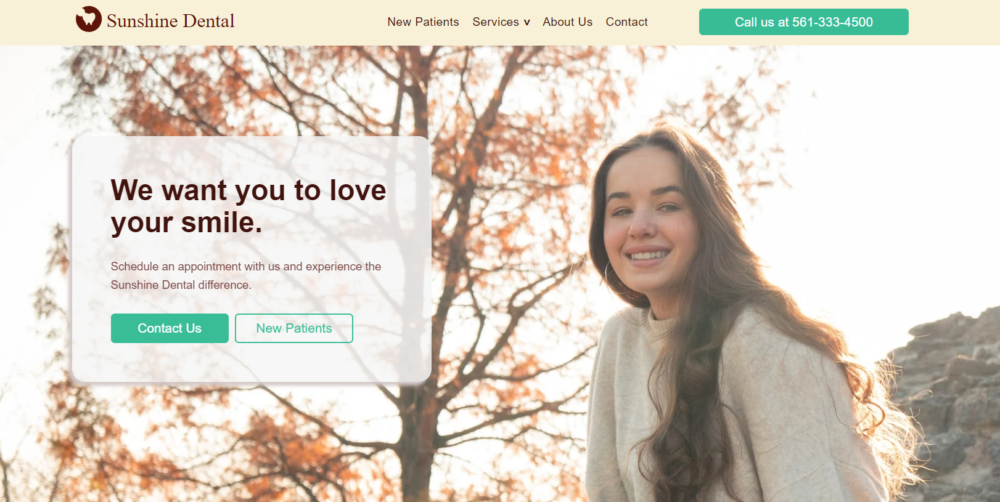

# Sunshine Dental



#### Top Technologies

[](#) [](#)

Sunshine Dental is a dentistry located in Valencia Shores Blvd. They do teeth cleanings, fillings & crowns, root canals, invisilign and more.
I made this website using React and Gatsby with Styled Components for the CSS. I used Formik to create the contact form and it is hosted with Netlify.

## Installation

1. Download repository
   ```bash
   git clone https://github.com/ElierHP/sunshinedental.git
   ```
2. Install packages
   ```bash
   npm install
   ```

## Start Application

1. run application
   ```bash
   gatsby develop
   ```

#### :mailbox: Reach out to me!

- :email: elierporto@gmail.com
